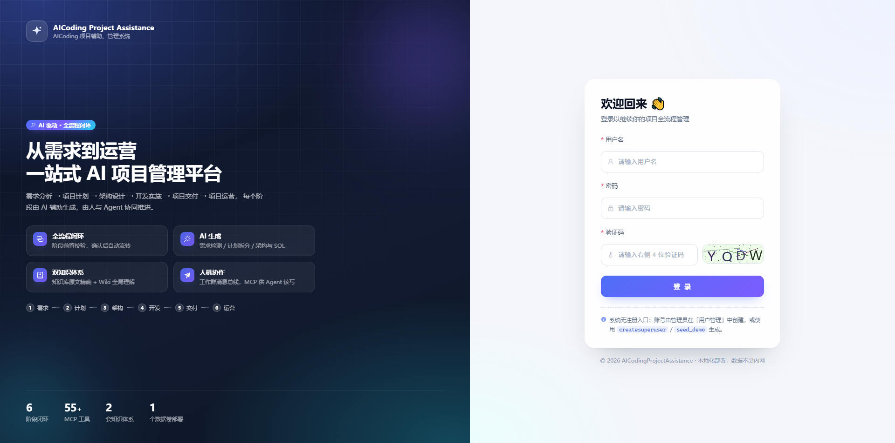
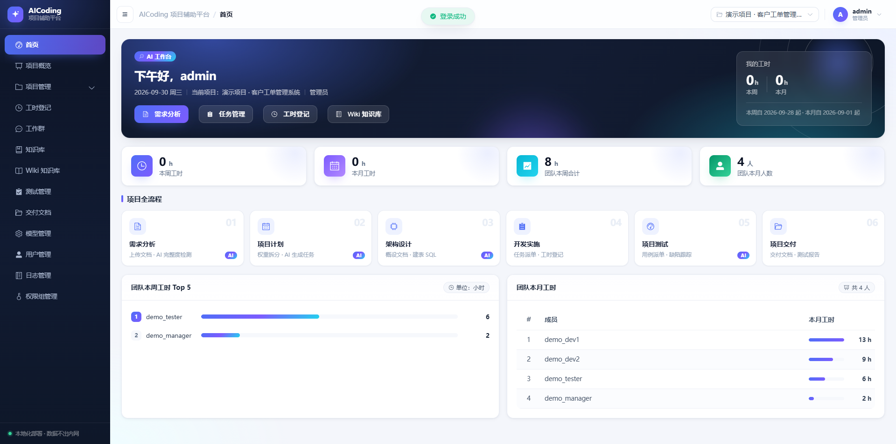
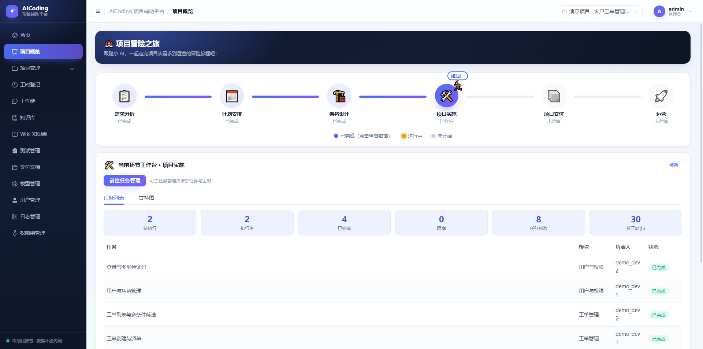
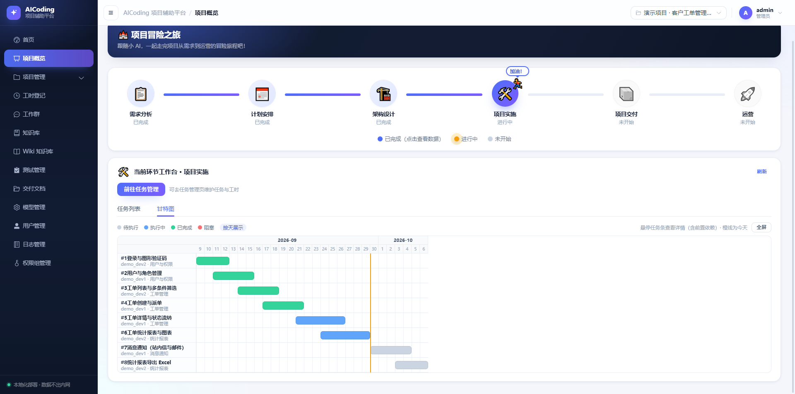

# AICodingProjectAssistance（AICoding项目辅助、管理系统）

[English](README.en.md) | **中文**

AI coding 开发项目全流程辅助、项目管理平台。覆盖 **需求分析 → 项目计划 → 架构设计 → 任务管理 → 工时登记 → 测试管理 → 交付文档 → 项目运营**，并提供知识库、Wiki 知识库、模型管理、权限管理与 MCP 服务。

**轻量级**：单机即可跑通全流程 —— 业务数据用 SQLite、向量库用内嵌 Chroma（都是本地文件，无需另起数据库或向量服务）；后端仅 13～14 个 Python 依赖，选远程 embedding 模式时无需安装 torch；MCP 服务端是单文件纯 stdio 实现，工具清单只依赖标准库；部署只有 2 个容器与 1 个数据卷。

---

## 界面预览

登录页与首页（AI 工作台）：

| 登录页 | 首页 · AI 工作台 |
|:---:|:---:|
|  |  |

项目概览 —— 项目全流程地图，点击任一阶段即可进入该环节的工作台：




## 特性

- **全流程闭环**：需求 → 计划 → 架构 → 开发 → 交付 → 运营，各阶段有前置条件校验，确认后自动流转到下一阶段。
- **AI 生成**：需求完整度检测、生成项目计划并按权重拆分任务、两步流式生成架构概设 + 建表 SQL、按需求/任务生成测试用例、生成周总结。
- **双知识体系**：知识库（传统 RAG，擅长原文精确）+ Wiki 知识库（LLM 先编译为结构化页面，擅长全局理解与双链导航）。
- **人机协作**：工作群作为人与 Agent 的消息总线，Agent 可汇报进度、认领任务；工时登记、成员画像辅助派单。
- **MCP 服务**：供 Trae / Claude Code / Cursor 等编程 Agent 直接读写平台数据，身份即权限。
- **权限模型**：白名单制 RBAC（菜单码与接口码联动），项目维度数据隔离。

## 技术栈

| 层 | 技术 |
|---|---|
| 后端 | Python + Django + DRF + SQLite + Chroma（向量库）|
| 前端 | Vue3 + Vite + Element Plus + Pinia |
| AI | LLM（OpenAI 兼容，如 DeepSeek）+ Embedding（本地 bge-small-zh 或远程）|

## 目录结构

```text
AICodingProjectAssistance/
├── backend/                    # Django 后端
│   ├── config/                 # settings / urls
│   ├── apps/                   # accounts projects requirements knowledge collaboration
│   │                           # testing delivery ai_config project_planning architecture wiki rbac operation
│   ├── services/               # llm / embedding / vector_store / document_parser / ai_config / vision
│   ├── db.sqlite3              # 业务数据库（迁移后生成，已 gitignore）
│   ├── chroma/ media/          # 向量库与上传文件（运行时生成，已 gitignore）
│   └── requirements.txt
├── frontend/                   # Vue3 前端
├── mcp-client/                 # MCP 服务端（单文件纯 stdio）
│   ├── mcp_server.py
│   └── mcp_server_config.example.json   # 配置模板（复制为 mcp_server_config.json 使用）
├── deploy/                     # Docker 编排、Dockerfile、nginx、数据打包脚本
└── docs/                       # 文档
    ├── 系统操作手册.md          # 页面操作与 MCP 使用说明
    └── images/                 # README 界面截图（login / dashboard / project-overview）
```

## 快速开始

### 1. 后端

```powershell
cd backend
python -m pip install -r requirements.txt

python manage.py migrate
python manage.py createsuperuser        # 创建管理员账号

# 可选：生成合成演示数据（演示账号 + 完整项目数据）
python manage.py seed_demo
```

> 想先看系统长什么样，执行 `python manage.py seed_demo` 即可得到演示项目与演示账号（密码统一 `demo12345`，如 `demo_manager` / `demo_dev1` / `demo_tester`）。数据全部由命令合成、不含真实个人信息；清空重来用 `python manage.py seed_demo --reset`。

### 2. 前端

```powershell
cd frontend
npm install
```

### 3. 启动

```powershell
# 终端 1：后端
cd backend
python -u manage.py runserver 127.0.0.1:8000

# 终端 2：前端
cd frontend
npm run dev
```

浏览器访问 http://127.0.0.1:5173/ （`/api` 与 `/media` 已代理到 8000）。

> 系统**无注册入口**，账号由管理员在「用户管理」中创建，或用 `createsuperuser` 创建。

## 配置

### LLM / Embedding

页面「模型管理」优先，环境变量兜底：

```powershell
$env:LLM_API_KEY="sk-xxx"
$env:LLM_BASE_URL="https://api.deepseek.com/v1"
$env:LLM_MODEL="deepseek-chat"
# 远程 embedding：$env:EMBEDDING_MODE="remote"; $env:LLM_EMBEDDING_MODEL="nomic-embed-text"
```

本地 embedding（默认 `BAAI/bge-small-zh-v1.5`）下载，二选一：

```powershell
# 方式 1：HuggingFace 镜像（设置后重启后端，首次「测试 Embedding」自动下载并缓存）
$env:HF_ENDPOINT="https://hf-mirror.com"

# 方式 2：ModelScope 离线下载（国内网络最稳）
python -m pip install modelscope
python -c "from modelscope import snapshot_download; print(snapshot_download('BAAI/bge-small-zh-v1.5', cache_dir='<你的模型目录>'))"
```

ModelScope 会生成 `.../snapshots/master/` 目录（模型真实文件所在），前面那层只是缓存索引 —— 在「模型管理」里要把本地模型名填到**含 `config.json` / `model.safetensors` / `tokenizer.json` 的那一层**。

### 服务令牌（供 MCP 等其它 agent 免登录调用）

```powershell
$env:PLATFORM_SERVICE_TOKEN="你的自定义令牌"
```

请求头带 `Authorization: Bearer <令牌>` 即可访问全部接口。该令牌映射为一个自动创建的管理员账号 `mcp`，**仅限本机/可信环境使用**。

> `DEBUG=0`（生产模式）时若仍使用默认令牌或默认密钥，后端会直接拒绝启动，强制你先改成自定义值。

## MCP 服务

服务端为单文件、纯 stdio 实现（工具清单只依赖标准库，实际调用接口时才需要 `httpx`）：

```powershell
pip install httpx
```

复制配置模板后填写（真实配置已 gitignore）：

```powershell
cp mcp-client/mcp_server_config.example.json mcp-client/mcp_server_config.json
```

```json
{
  "PLATFORM_API_URL": "http://127.0.0.1:8000",
  "PLATFORM_API_TOKEN": "mcp-xxxxxxxxxxxxxxxx",
  "PLATFORM_PROJECT_ID": "1"
}
```

在 Cursor / Claude Code / VS Code / Trae 中注册（`PLATFORM_API_TOKEN` 建议填「用户管理」里该用户的 **MCP Token**，`mcp-` 开头）：

```json
{
  "mcpServers": {
    "ai-platform": {
      "command": "python",
      "args": ["./mcp-client/mcp_server.py"]
    }
  }
}
```

共 55 个工具，覆盖知识库 / Wiki、需求 / 计划、架构 / SQL、任务 / 工时 / 群消息、测试 / 缺陷、运营、原型图 / 成员画像、交付文档。常用如 `knowledge_search`、`requirement_content_query`、`architecture_query`、`task_query`、`task_update`、`worklog_submit`，完整清单见 [操作手册](docs/系统操作手册.md) 第 4 章。

## Docker 部署（Linux）

两个服务：`backend`（Django + gunicorn）与 `frontend`（nginx 托管前端并反代），运行数据落在 `deploy/data/` 数据卷。

```bash
# 服务器前置
sudo apt update && sudo apt install -y docker.io docker-compose-v2
sudo systemctl enable --now docker
```

```powershell
# Windows 上把当前数据（数据库/向量库/上传文件）打包到 deploy/data_initial/
cd AICodingProjectAssistance
powershell -ExecutionPolicy Bypass -File deploy\prepare_data.ps1
```

把整个目录上传到服务器（**务必包含 `deploy/data_initial/`**），然后：

```bash
cd AICodingProjectAssistance/deploy
docker compose up -d --build
```

浏览器访问 `http://服务器IP/`（首次构建拉取镜像、装依赖，耗时几分钟到十几分钟属正常）。

### 上线前必配

写入 `deploy/.env` 或 export 到环境变量：

| 变量 | 说明 |
|---|---|
| `DJANGO_SECRET_KEY` | **必填**。未设置时 compose 直接报错退出，避免用开发默认密钥上线。生成：`python deploy/gen_secret.py` |
| `PLATFORM_SERVICE_TOKEN` | **必填**。默认值会映射为管理员账号 `mcp`，`DEBUG=0` 时后端拒绝启动 |
| `DJANGO_ALLOWED_HOSTS` | 默认 `*`，建议改为服务器 IP 或域名 |

### 两种部署形态

两者数据卷相同，**请固定一种，混用会导致向量库与 embedding 模型不一致**：

- **轻量远程版（默认）**：不装 torch，容器通过 OpenAI 兼容接口远程调用 embedding（`EMBEDDING_MODE=remote`），镜像小、构建快。
- **本地内置版**：镜像内置 bge-small-zh，离线可用，代价是首次构建需下载 torch（约 500MB+）。

```bash
# 切到本地内置版
export INSTALL_LOCAL_EMBEDDING=true
export EMBEDDING_MODE=local
docker compose up -d --build
```

pip 依赖默认走清华源、模型默认走 hf-mirror.com（国内开箱即用）；海外服务器改官方源时需**先构建再启动**（不要用 `--build`，否则不会带上这些参数）：

```bash
docker compose build --build-arg PIP_INDEX_URL=https://pypi.org/simple --build-arg HF_ENDPOINT=https://huggingface.co
docker compose up -d
```

### 注意事项

- 首次启动数据库只有表结构，需要演示数据时在服务器执行：
  `docker compose exec backend python manage.py seed_demo`（清空重建加 `--reset`）。
- `deploy/data_initial/` 由 `prepare_data.ps1` 从本机打包，内含数据库与上传文件（可能有 API Key 与业务数据），已在 `.gitignore` 中排除，**请勿提交或公开**。
- **更新已有数据**：重新打包后需先删除 `deploy/data/`（或其中对应项）再 `docker compose up -d`，否则不会覆盖。
- 常用命令：`docker compose logs -f backend`（看日志/启动报错）、`docker compose down`（停止）、`docker compose up -d --build`（改代码后重建）。
- 访问不通先检查防火墙是否放行 80 端口（如 `ufw allow 80/tcp`），或改 `docker-compose.yml` 的端口映射。

## 项目生命周期

```text
需求分析 → 项目计划 → 架构设计 → 开发实施 → 项目交付 → 项目运营
```

- **需求分析**：上传需求文档 → AI 完整度检测 → 确认入库
- **项目计划**：选成员与开发权重 → AI 生成计划 → 生成任务并指派
- **架构设计**：选技术栈/底座/数据库 → 两步流式生成架构概设 + 建表 SQL
- **任务管理**：查看/增删/改状态；工时登记关联任务；导出 Excel

## 两套知识体系

|  | 知识库 | Wiki 知识库 |
|---|---|---|
| 机制 | 传统 RAG：切片 + 向量检索 | LLM 先把源文档编译为结构化页面，再检索 |
| 强项 | **原文精确**：某条怎么写的、精确数值 | **全局理解**：怎么设计、为什么这么定、模块如何关联 |
| 弱项 | 切片有噪声，答不了跨模块综合问题 | 提炼会丢失原文措辞与细节 |
| 存储 | Chroma collection `project_{id}` | SQLite + 独立 collection `wiki_{project_id}`（物理隔离）|

问答机制：知识库是一次性 top-k 向量检索；Wiki 是 Agentic 多轮（先命中页面，不足时顺双链补充关联页，最多 3 页）。源文档更新后 Wiki 可**覆盖式重编译**，无新旧切片混杂问题。

## 主要 API

| 模块 | 端点 |
|---|---|
| 认证 | `/api/auth/login/` `/refresh/` `/me/` `/change-password/` `/admin-users/` |
| 项目 | `/api/projects/` `/members/invite/` `/members/{uid}/` |
| 需求 | `/api/requirements/upload/` `/{id}/analyze/` `/{id}/confirm/` |
| 知识库 | `/api/knowledge/add/` `/search/` |
| 计划 | `/api/project-plans/generate/` `/{id}/regenerate/` `/{id}/generate-tasks/` |
| 任务 | `/api/plan-tasks/` |
| 架构 | `/api/architecture/generate-stream/` `/{id}/chat-stream/` `/{id}/chat/` |
| 工时/周总结 | `/api/work-logs/`（含 `/statistics/`、`/export/`）、`/api/weekly-summaries/` |
| 测试 | `/api/test-cases/` `/api/test-tasks/dispatch/` |
| 交付 | `/api/delivery-docs/` `/upload/` |
| 模型管理 | `/api/ai-config/` `/api/ai-config/test/` |

## 常见问题

| 问题 | 处理 |
|---|---|
| 服务令牌 401 | 确认已重启后端（认证器顺序已调整为服务令牌在前） |
| 本地 Embedding 超时 | 多为 HuggingFace 不可达，设置 `HF_ENDPOINT=https://hf-mirror.com` 或改用 ModelScope |
| AI 生成/对话慢 | 请求超时已放宽；如仍不够可调大 `frontend/vite.config.js` 中 `/api` 的 `proxyTimeout` |
| 新增 app 后 | 执行 `python manage.py makemigrations && python manage.py migrate` |
| 页面菜单看不到 / 接口 403 | 该功能的资源码未授予你的权限组，到「权限组管理」勾选对应菜单码 |

更详细的页面操作与 MCP 使用说明见 **[操作手册](docs/系统操作手册.md)**。
